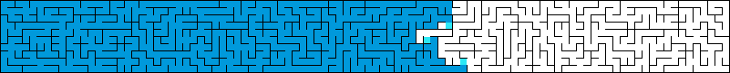

# Evolution is wrong
`2024-01-24`

TL;DR: evolution is just flood fill, but you're not giving flood fill enough credit.

## Survival of the fittest

[Darwinism](https://en.wikipedia.org/wiki/Darwinism) is a theory of biological evolution, stating that all species of organisms arise and develop through the natural selection of small, inherited variations that increase the individual's ability to compete, survive, and reproduce.

It is the survival of the fittest. A fierce competition for the crown. Evolution is an [optimization algorithm](https://en.wikipedia.org/wiki/Mathematical_optimization) and its objective is to finds the best of the best. And by that we mean us. Humans. We're the best. 🥳

Survival of the fittest is great because we're winning. Except, what about birds?  They also survived. Are they also... the fittest?

## Natural selection

Okay, so we have to be a little bit more specific and define fitness to mean "better designed for an immediate, local environment", nowadays commonly called an [ecological niche](https://en.wikipedia.org/wiki/Ecological_niche). How many niches are there? Well, there are currently about [10 million species](https://en.wikipedia.org/wiki/Biodiversity) on our planet. If all of them are the fittest then there are at least 10 million niches.

Fine, so evolution is a [multi-objective optimization algorithm](https://en.wikipedia.org/wiki/Multi-objective_optimization) with 10 million objectives and it finds the bests of the bests. And by that we mean us. And everything else. 🙂

Except, what about dinosaurs? They survived for millions of years. They were the fittest. At least until [Chicxulub](https://en.wikipedia.org/wiki/Cretaceous%E2%80%93Paleogene_extinction_event).

## Ecology

Okay, so we have to be a little bit more specific and define environment to mean whatever is around at that moment in time. We also have to factor in that our species are affecting the environment for other species, leading to [multi-species coevolution](https://en.wikipedia.org/wiki/Coevolution), biome formation, and all of ecology. On our planet, evolution has produced over 5 billion species total, each of them the fittest at their point in time and space. Virtually all of them are extinct by now. Survival of the... uhm.

Fine, so evolution is an optimization algorithm and its objective is... something? It's complicated. 😐

Although, remember humans? We're complex and clever and awesome. Evolution produced us, so it must be doing something smart.

## Complexity

Okay, so how about this: evolution is optimizing for increase in complexity. Look at the [tree of life](https://en.wikipedia.org/wiki/Tree_of_life_(biology), We're clearly seeing an increase in complexity at every level, so evolution has to be searching for that, right? It can't just be randomly changing DNA and seeing what sticks, right? It can't just be an exhaustive search like [flood fill](https://en.wikipedia.org/wiki/Tree_of_life_(biology)). Flood fill could never produce complexity. Flood fill just does...

| Evolution            | Flood fill     |
|----------------------|----------------|
| DNA                  | node           |
| population           | open set       |
| mutation / crossover | neighbor set   |
| selection            | permissibility |

Oh no.

## Flood fill

Flood fill can solve any maze. If there exists a path at all, flood fill will find it. If there is a goal, flood fill will reach it without even searching for it, without even knowing it exists. It would be a stretch to call flood fill a [search algorithm](https://en.wikipedia.org/wiki/Search_algorithm) and yet it finds everything. It would be even more of a stretch to call flood fill an optimization algorithm, yet it finds the _shortest_ path to the goal. And it never gets stuck in some local optimum.

Furthermore, if you imagine flood fill on a dynamic map where walls spawn in and out of existence, flood fill will still work if you keep all your visited nodes in the open set.

If you pause flood fill at any point and unwind all the paths it has taken so far, tracing back to the root, you get something that looks remarkably close to a tree of life. If you look at a particular path from the root to any goal, you can reconstruct the steps it took to get there, surprisingly often going in the wrong direction first to get around some obstacle along the way. You can then create a story about how smart it must have been in order to be able to find this unlikely path.

But you know that it's just flood fill. All it does is expanding from nodes that it has already visited to nodes that it hasn't visited.

## Stepping stones

It turns out that expanding from visited nodes is all you need. You can call these nodes [stepping stones](https://wiki.santafe.edu/images/3/34/Stanley_innovation_workshop14.pdf) and even if you don't know where they lead, as long as you keep collecting more stepping stones you will eventually get somewhere. Everywhere, in fact.

Counterintuitively, [just collecting stepping stones can even be faster at reaching your goal than heading straight for the goal](https://www.youtube.com/watch?v=dXQPL9GooyI). For ambitious goals this basically happens all the time, almost by definition, because if you knew how to break down the path to your goal into actionable steps then it wouldn't be particularly ambitious.

We can even exploit this concept by building an optimization algorithm that optimizes for novelty. [Novelty search](https://www.cs.swarthmore.edu/~meeden/DevelopmentalRobotics/lehmanNoveltySearch11.pdf) simply rewards being different, and it works remarkably well. This has wide ranging implications for people in research and in creative fields.

## Assembly theory

TODO Jonas:
- assembly theory
