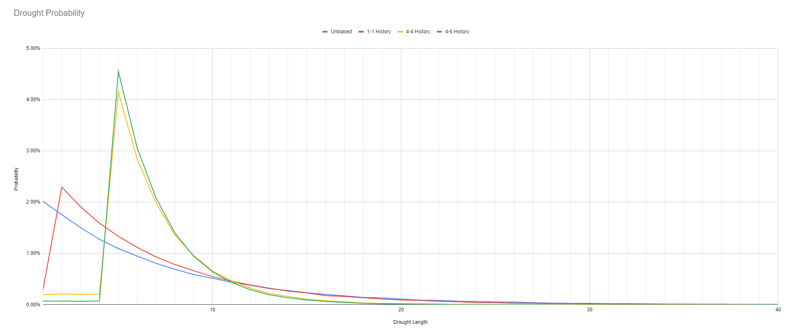
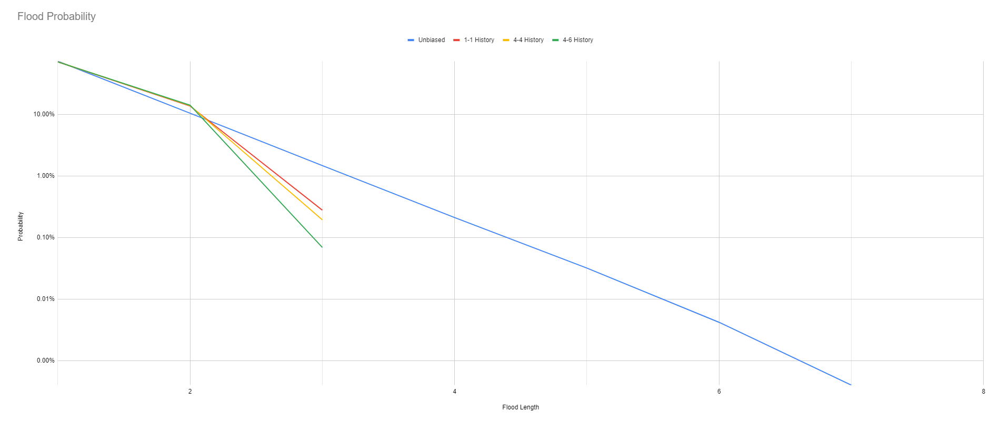
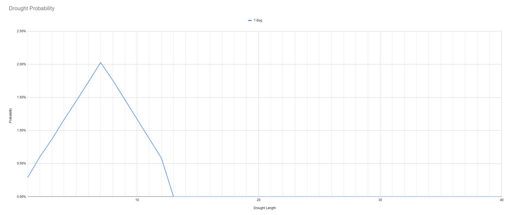
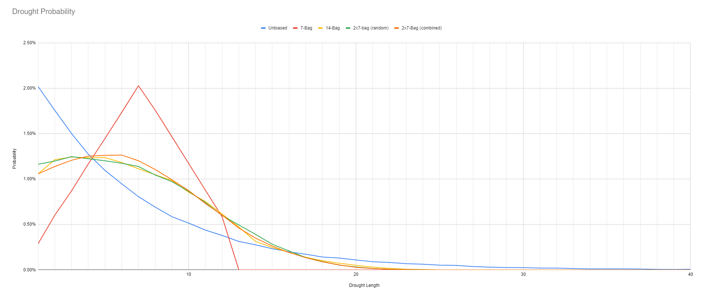

# Fair Tetris
`2024-06-23`

## Floods and droughts

Tetris has seven shapes of blocks that the player must assemble into lines to clear them. Clearing more lines at the same time results in a higher score, which is why players covet the `|` pieces that allow them to clear four lines at once.

A drought is when the right piece doesn't show up for a long time. A flood is when the same piece keeps showing up in a row. Both are very bad for competitive play and just feel unfair.

## Randomizers

The original Tetris, released in 1985, had no concern for such problems. It used an unbiased randomizer, which uniformly samples one of the seven pieces. Consequently, there is no upper limit on the length of a drought.

NES Tetris improved upon the formula by keeping a history to prevent the same piece from showing up twice, and while that did help with floods, it didn't help much with droughts. TGM Tetris continued down that path by keeping a longer history and retrying more often.

## Bags

Eventually, The Tetris Company settled on the 7-bag randomizer. The seven pieces are thrown into a bag, shuffled, and pulled out one by one. Once the bag is empty, they are all thrown back into it and shuffled again. This is the same as a shuffled deck of seven cards.

The 7-bag is great for two reasons, it is impossible to get the same piece more than twice in a row and droughts can never last longer than 12 pieces. Finally a hard upper limit!

Problem solved, right?

## Card counting

The problem with bags is that it becomes easy to predict what is left inside the bag if you keep track of what has been taken out so far. The entire reason we use randomness in games is to make it unpredictable what is going to happen next, forcing the player to adapt on the fly instead of memorizing patterns.

Can we do better?

## More bags

The simplest change we can make is to throw twice as many pieces into the bag. This 14-bag randomizer already exhibits most of the desired properties. There is a hard limit of 24 pieces on droughts and a hard limit of 4 pieces on floods. Additionally, for the first 10 out of 14 pieces, it is difficult to predict the next piece.

Another option is to use two bags, A and B, each filled with seven pieces. We first roll which bag to pick and then proceed to take one piece out of that bag. Once one of the bags is empty, we immediately refill it with the original seven pieces. This strategy, let's call it a 2x7-bag, gives us the same hard guarantees as a 14-bag. Additionally, due to the extra bit of randomness, it becomes virtually impossible to predict which piece is next.

A slight variation of the 2x7-bag strategy is to think of the pieces as colored. Let's imagine two sets of seven pieces, one set is red, one set is blue. We keep them together in a 14-bag. However, as soon as there are no red pieces left in the bag, we refill it with the original seven red pieces. Same for blue. While we are using the color internally to determine when to refill, we hide the color from the user. This hidden bit of information makes it virtually impossible for the user to predict which pieces are left.

While these two strategies share many properties, they are not identical. The two-bag strategy uniformly picks a bag, while the red/blue strategy is more likely to pick the color that has more pieces left, leading to a slightly more balanced feel.

Both are very easy to implement and scale to arbitrary many elements while requiring a linear amount of memory. Maybe don't use them for Tetris though, because a 24 piece drought is still pretty rough.

## Further Reading
- [The history of Tetris randomizers](https://simon.lc/the-history-of-tetris-randomizers) by Simon Laroche
- [Playing forever](https://tetris.wiki/Playing_forever) by Tetris Wiki
- [Apparent Probability](apparent-probability.md) by me
- [Fair Randomness](fair-randomness.md) by me
