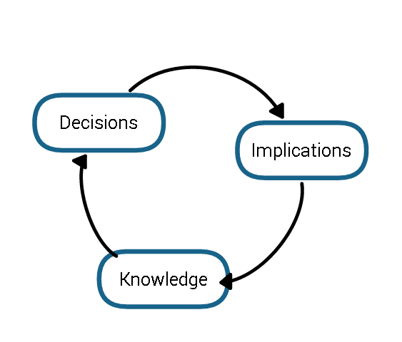
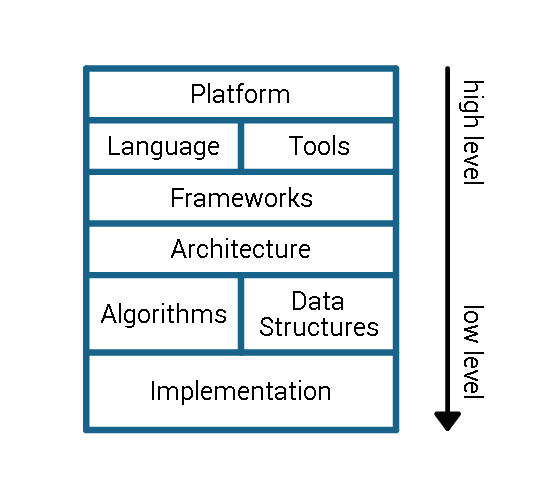

# Importance of Knowledge

## Knowledge Age

If you run a business in the [knowledge age](http://en.wikipedia.org/wiki/Knowledge_worker) then there is a good chance that it involves some kind of development. That’s were engineers come into play. You can say [engineering](http://en.wikipedia.org/wiki/Engineering) is about applying scientific knowledge and ingenuity to develop technical solutions. But because there’s always more than one solution to a problem it’s also a lot about making good decisions. Decisions that will affect the future of your business!

## Decisions

In the presence of multiple possible solutions to a given problem the key to making good decisions is knowing their respective strengths and weaknesses. Oftentimes there is a tradeoff. Therefore it’s a good idea to evaluate the available options according to your individual business requirements. So [make sure to know your requirements](http://www.joelonsoftware.com/articles/fog0000000356.html)!

Also note that these decisions might occur on multiple levels of abstraction. This is especially true for software development. Strategic decisions like what target platforms to support, what programming language to use, and what tools to employ are usually made by the management. On the other hand most low level decisions like what algorithms to apply and how to implement them are usually left to the programmer. Inbetween senior engineers decide about frameworks, architecture and data structures - the core of your product.

## Implications

Every decision has far reaching consequences on the levels below it. They force constraints and limitations on the available options further down. That is why you want your high level decisions to be made early and to stay stable. Also make sure they are good. Otherwise you would be wasting time, money, and lots of effort.

Mid level decisions tend to have the strongest implications on the ability of the product to actually meet the business requirements. This is where fulfillment is created within time and budget - or where it fails. This is also where the ability to react to ever changing requirements is determined. Like with a huge building you want your architecture to be clean and stable, yet flexible enough to cope with unforeseen demands. A rigid architecture will soon become messy, and a messy one will soon become unmanageable. So well engineered architecture and data structures are key to retaining agility.

## Knowledge

Ingenuity and scientific knowledge is necessary to come up with possible solutions to existing problems. And by now it should be clear that a deep understanding of the available options and their respective implications is key to making a good decision. All of this highlights the importance of knowledge.

Engineering knowledge can be obtained by higher education, professional training, and experience. Your business will want to acquire, build, and retain it, because loosing knowledge means reduced agility, going into dead ends, and ultimately loosing the ability to fulfill requirements!

## Conclusion

- Acquire knowledge by hiring highly trained and experienced people.
- Evaluate each possible solution regarding individual business needs.
- Document each decision, its rationale, and its implications. It seems like a lot of work but it's pays off. Omit documenting the implementation!
- Build additional knowledge through reflection and team training.
- Keep knowledge by retaining your team. It's good for your business!

I hope all of this makes sense to you. It might even be obvious to you. I totally agree, it should be obvious. But it's a lot easier said than done and I've seen noble goals go overboard as soon as time is short. Resist the temptation of shortsighted decisions!
