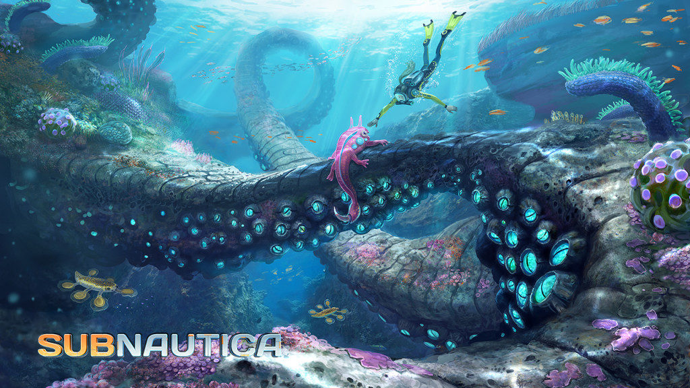
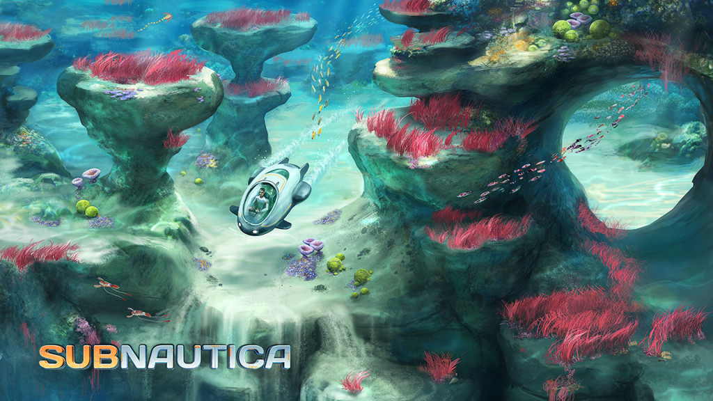

# Open development

I am very lucky to be working for [Unknown Worlds Entertainment](http://unknownworlds.com/) on their upcoming underwater exploration game [Subnautica](http://unknownworlds.com/subnautica/). Lucky because of many reasons. For starters Subnautica is an exceptional game. Like traditional high quality games it features gorgeous graphics and a masterfully crafted world. Unlike traditional games it does not involve shooting things and killing stuff though. It is very peaceful. I am excited about that! Moreover I am lucky because my [colleagues](http://unknownworlds.com/subnautica/the-crew-of-subnautica/) are amazing folks and I can work remotely from anywhere in the world.

We employ a pretty unconventional style of development where all information, all tasks, all work in progress is public. Fellow game developer [Tim Keenan](http://www.avirusnamedtom.com/about_us.html) coined the term [naked development](https://www.youtube.com/watch?v=5ZDMja8dY8E&list=PLWuf3ThLEyAgy-V9EtFo_LA-96_lrGTKf) for this. The game is far from finished. In fact there is hardly any game in the game yet. Despite that everyone can have a look at our [Subnautica Trello board](https://trello.com/b/yxoJrFgP/subnautica) and see what we are doing. Furthermore by the end of October interested players will be able to access the in-development version of the game. That is a scary thought! But I am sure we will get lots of valuable feedback that will help us to make this game great.
