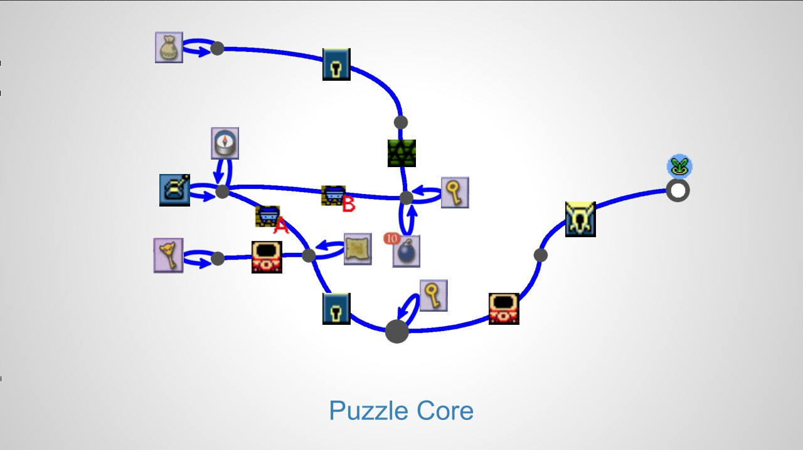
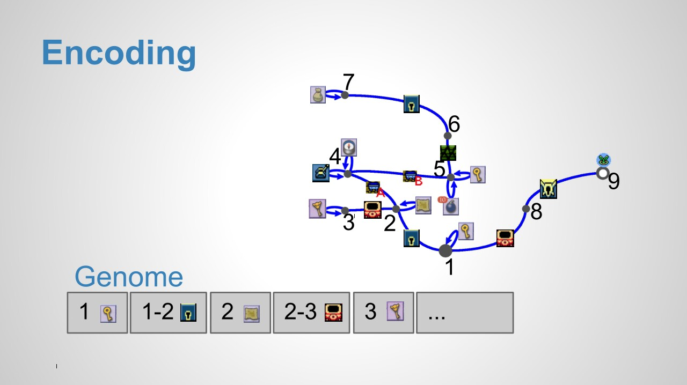
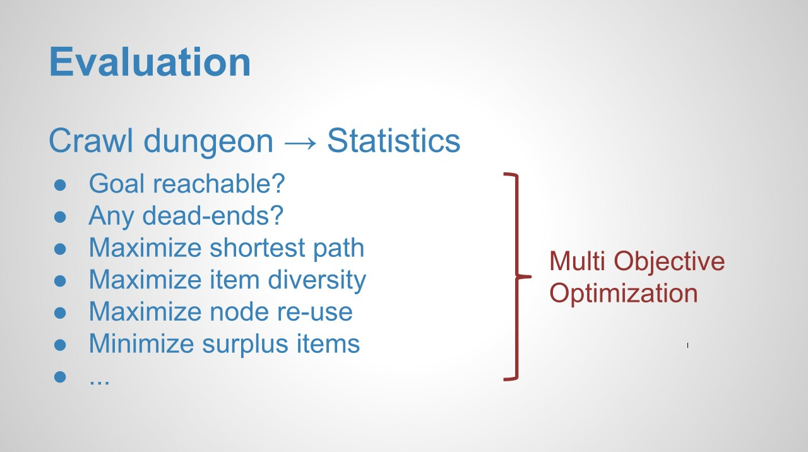

# How to procedurally generate Zelda dungeons
`2013-12-05`

Yesterday I gave a [microtalk](http://www.youtube.com/playlist?list=PLWuf3ThLEyAgy-V9EtFo_LA-96_lrGTKf) at one of the incredible [Unknown Worlds Entertainment](http://unknownworlds.com/)‘s postmortem get-togethers. The talk is appropriately titled [How to procedurally generate Zelda dungeons](procedural-zelda/procedural-zelda.pdf). I hope to see the recordings online soon. Until then here are my slide and slide notes:

1.    (Introduction)
2.    Zelda dungeons are awesome because they combine fighting and puzzles. Let’s focus on the puzzles.
3.    The dungeon puzzle is really just obstacles and collectable items to overcome the obstacles.
4.    Example: You enter the dungeon in the southmost room. In the next room you’ll see four exits, one is blocked by a door with a keyhole. You’ll need to go east to find the key. You’ll also notice another door there that unlocks if you can light the torch next to it. To do this you must solve all of the west/north part of the dungeon. In the northwestmost room you’ll find the satchel with ember seeds. You’ll need to go all the way back to light the torch and continue eastwards to beat the dungeon’s boss. Note that exploring the dungeon is highly nonlinear and requires lots of backtracking.

5.    The puzzle itself can be represented as a graph. I will explain how to generate graphs like this one. Being able to do so is exciting, because it solves a classic problem in game design, i.e.
6.    The conflict between progammers and designers, generating content for novelty and replay value vs. creating content for specific purpose and artistic vision, unlimited new stories vs. one good story. You can have both. Generating complex dungeon puzzles is creating good new stories.
7.    I’m using a genetic algorithm to grow these puzzle graphs. I’m guiding the evolution to favor purposive puzzles. The genetic algorithm needs to know the following three things:

8.    Encoding. You can encode a graph into a genome by using a list of edges referring to their nodes by number. Obstacle edges need two nodes, item edges only one. Each edge becomes a gene.
9.    Mutation. Meaningful operations on the genes are for example changing node numbers, items or obstacles. Operations on the genome include adding and removing genes, of course.

10.    Evaluation. Decode the genome grown by the genetic algorithm into a graph. Run a brute force crawler on the graph. Define objectives like no dead ends, long shortest path, etc. to guide the evolution. Use multi-objective optimization.
11.    (Result example)
12.    (End)
13.    (Contact information)

Note that these puzzles are not limited to games like Zelda. They can be found in pretty much any game involving puzzles and are also the heart of every [classic adventure](http://www.brokenagegame.com/about/). Of course there are lots of details that still need to be explained, but these microtalks are limited to five minutes. If you are interested in the topic, please let me know by leaving a comment!
