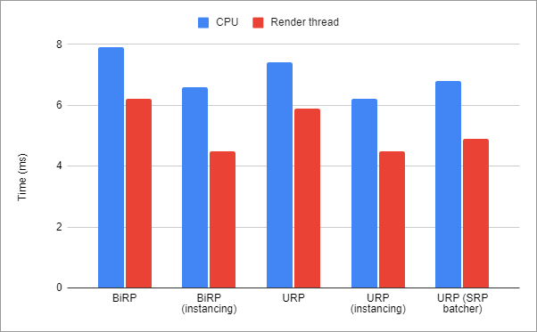

# Profiling the Scriptable Render Pipeline
`2022-03-14`

A summary of how to profile Unity's Scriptable Render Pipeline. This includes [URP](https://docs.unity3d.com/Manual/universal-render-pipeline.html), [HDRP](https://docs.unity3d.com/Manual/high-definition-render-pipeline.html), and custom [SRP](https://docs.unity3d.com/Manual/ScriptableRenderPipeline.html)s.

## TL;DR:
1. Forget about GPU instancing.
2. Forget about `MaterialPropertyBlock`s.
3. Careful with unintentional shader variants.

## Profiling the Built-in Render Pipeline
Back in the old days Unity only had a single render pipeline, now called the [Built-in Render Pipeline](https://docs.unity3d.com/Manual/built-in-render-pipeline.html) (BiRP). Profiling what the BiRP is doing is easy enough.

### Stats

The [Rendering Statistics panel](https://docs.unity3d.com/Manual/RenderingStatistics.html) gives a quick overview of useful statistics like triangles and vertices rendered as well as, how many draw calls were batched together.

### Rendering Profiler

The [Rendering Profiler module](https://docs.unity3d.com/Manual/ProfilerRendering.html) shows a breakdown of watch got batched and why.

### Batching
Besides obvious indicators like triangles and vertices, a lot of profiler work goes into batching. Why? It turns out that [draw calls are expensive](https://docs.unity3d.com/Manual/optimizing-draw-calls.html), so optimizing rendering performance often involves reducing draw calls, e.g. through [GPU instancing](https://docs.unity3d.com/Manual/GPUInstancing.html), [static batching](https://docs.unity3d.com/Manual/static-batching.html), or [dynamic batching](https://docs.unity3d.com/Manual/dynamic-batching.html).

The reason why there are so many different methods addressing the same problem is that none of them are universally applicable.
- GPU instancing only works for the same mesh.
- Static batching only works for static geometry that doesn't move.
- Dynamic batching produces so much overhead that it's almost never useful.

Oh and all of them only work if it's the same material, i.e. literally the same material instance. That's why we get [MaterialPropertyBlock](https://docs.unity3d.com/ScriptReference/MaterialPropertyBlock.html) to change material properties without breaking draw call batching. You might even go so far to require a single material across your entire project, using only `MaterialPropertyBlock`s at runtime to assign textures.

## Profiling the Scriptable Render pipeline
The first thing to note when profiling the Scriptable Render Pipeline is that the [rendering profiler](https://docs.unity3d.com/Manual/ProfilerRendering.html) and the [statistics panel](https://docs.unity3d.com/Manual/RenderingStatistics.html) are broken. The reported batching numbers don't make sense.

### Frame debugger

We have to use the [Frame Debugger](https://docs.unity3d.com/Manual/FrameDebugger.html) to get an accurate picture of what is really going on under the hood. The frame debugger correctly reports draw calls, batching, and instancing.

### GPU instancing
Using SRP, GPU instancing does not work. Try as you might, the number of batched draw calls due to instancing is always zero. That is because [SRP comes with its own batcher](https://docs.unity3d.com/Manual/SRPBatcher.html) and Unity prioritizes its SRP batcher over GPU instancing.

That sounds bad, but it turns out the SRP batcher is almost as fast as GPU instancing. Almost.

| Render pipeline | GPU instancing | SRP batcher | Draw calls | CPU (ms) | Render thread (ms) |
|-----------------|----------------|-------------|------------|----------|--------------------|
| BiRP            | off            | N/A         | 10,000     | 7.9      | 6.2                |
| BiRP            | on             | N/A         | 20         | 6.6      | 4.5                |
| URP             | off            | off         | 10,000     | 7.4      | 5.9                |
| URP             | on             | off         | 30         | 6.2      | 4.5                |
| URP             | on/off         | on          | 15         | 6.8      | 4.9                |

Interestingly, URP with the SRP batcher turned off is slightly faster than BiRP and supports GPU instancing just the same.

### Batching
Static batching works the same in SRP and BiRP and produces the same speed-ups. Dynamic batching also works the same but is disabled in HDRP because it's a bad idea. Relying on the SRP batcher is usually the better choice.

## SRP Batcher
The [SRP batcher](https://docs.unity3d.com/Manual/SRPBatcher.html) is a good default because it works in a wide variety of scenarios.
- Unlike GPU instancing it works across different meshes.
- Unlike static batching it works for geometry generated at runtime.
- Unlike dynamic batching its overhead is small.

But most importantly it works across multiple materials, with a few caveats:
1. Must not use `MaterialPropertyBlock`.
2. Must use the same shader variant.
3. Shader must be compatible with SRP batcher.

These are important caveats so let's break them down

### MaterialPropertyBlock
[MaterialPropertyBlock](https://docs.unity3d.com/ScriptReference/MaterialPropertyBlock.html)s are simply not supported by the SRP batcher. That means they do the opposite of what they do in BiRP. Instead of making things faster, they make things slower. The affected renderers get taken out of the SRP batching queue and put into the regular old queue.

All the old tricks apply for the old queue and under very specific circumstances it is possible to beat the SRP batcher. However, chances are you wanted to help reduce draw calls and facilitate GPU instancing but ended up increasing draw calls because you blocked the SRP batcher.

Just use material instances instead.

### Shader variants
While the SRP batcher works across different materials, the [shader variant](https://docs.unity3d.com/Manual/shader-variants.html) must be the same. A shader can have multiple variants by using [shader keywords](https://docs.unity3d.com/Manual/shader-keywords.html).

Most importantly, the `URP/Lit` shader is a "smart" uber shader that strips out unused code automatically. For example if there is a normal map assigned, the `_NORMALMAP` keyword will be enabled. That means materials with normal map will not batch with materials that don't use a normal map.

Use as few variants as possible. Use the frame debugger to verify.

### Compatibility
All lit and unlit shaders in the High Definition Render Pipeline (HDRP) and the Universal Render Pipeline (URP) are compatible with the SRP batcher. That's probably all you need to know.

If you must use custom shaders, follow the [requirements](https://docs.unity3d.com/Manual/SRPBatcher.html#shader-compatibility) and double check the inspector panel to see if it worked.

## Summary
The SRP batcher is great but the profilers have not been updated yet. Use the frame debugger to get accurate reports. Don't use `MaterialPropertyBlock`s anymore. Don't bother with GPU instancing settings. Use as many materials as you want. Use `URP/Lit` for everything. Use the frame debugger to double check that the shader keywords are the same across your materials.

## References
- https://docs.unity3d.com/Manual/built-in-render-pipeline.html
- https://docs.unity3d.com/Manual/ScriptableRenderPipeline.html
- https://docs.unity3d.com/Manual/universal-render-pipeline.html
- https://docs.unity3d.com/Manual/high-definition-render-pipeline.html
- https://docs.unity3d.com/Manual/RenderingStatistics.html
- https://docs.unity3d.com/Manual/ProfilerRendering.html
- https://docs.unity3d.com/Manual/FrameDebugger.html
- https://docs.unity3d.com/Manual/optimizing-draw-calls.html
- https://docs.unity3d.com/Manual/GPUInstancing.html
- https://docs.unity3d.com/Manual/static-batching.html
- https://docs.unity3d.com/Manual/dynamic-batching.html).
- https://docs.unity3d.com/Manual/SRPBatcher.html
- https://docs.unity3d.com/ScriptReference/MaterialPropertyBlock.html
